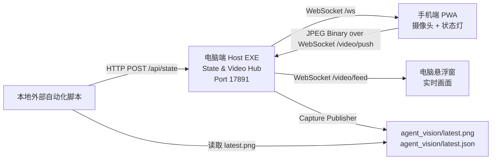

# AgentEye 课题成果报告

**报告日期**: 2026-06-09  
**项目阶段**: Phase 2 MVP 阶段性成果  
**课题定位**: 面向嵌入式与硬件开发场景的局域网视频观察与状态同步系统  
**维护约定**: 后续若修改代码、增加功能或调整通信协议，本报告需要同步更新，作为毕业设计答辩与架构复盘的长期文档。

---

## 1. 课题背景与应用场景

### 1.1 背景问题

**大白话说明**:  
硬件工程师调试开发板时，经常一边看电脑终端，一边低头看电路板、LED、屏幕、跳线和串口输出。问题是，电脑里的外部自动化脚本虽然能读代码、改文件、运行命令，却看不到桌面外面的真实硬件状态。因此，人需要不断口头或文字描述“灯亮了没有”“屏幕变了没有”“板子有没有复位”，整个调试过程被人为观察拖慢。

**专业术语总结**:  
本课题解决的是本地自动化控制流程与物理世界反馈之间缺少实时视觉输入通道的问题，本质上属于“物理设备状态可视化采集、局域网实时传输与外部控制脚本协同”的系统架构问题。

### 1.2 应用场景

**大白话说明**:  
AgentEye 的作用可以理解为“给电脑旁边的自动化脚本加一只物理眼睛”。手机或 USB 摄像头对准开发板，电脑端显示一个永远置顶的小悬浮窗，外部脚本只要读取固定目录下的 `latest.png`，就能拿到最近一张开发板画面。与此同时，手机屏幕还能显示红、黄、绿等状态灯，让工程师不用一直盯着电脑，也能知道当前脚本是在运行、空闲还是出错。

**专业术语总结**:  
系统通过 Host 端状态与视频分发中心，将移动端摄像头采集、桌面端低延迟显示、控制状态广播和本地文件发布整合为一个局域网内的实时感知闭环。

### 1.3 弱化 AI 后的课题表述

**大白话说明**:  
本项目不依赖“AI 是否聪明”这个概念。即使把 AI Agent 换成普通的 Python 脚本、Shell 脚本或任意自动化工具，AgentEye 仍然成立：外部程序负责发状态信号和读取图片，AgentEye 负责把手机摄像头画面和状态灯可靠地同步起来。

**专业术语总结**:  
本系统将外部智能体抽象为“本地自动化控制脚本”，重点研究局域网环境下控制信号、视频数据和本地可读文件之间的可靠通信与数据发布机制。

---

## 2. 系统总体拓扑

### 2.1 总体结构

**大白话说明**:  
整个系统的中心是电脑端 Host 程序，也就是一个 Windows EXE。它监听 `17891` 端口，像一个小型中转站：外部脚本把状态告诉它，手机把摄像头画面传给它，它再把状态和画面分发到需要的地方。

**专业术语总结**:  
Host 程序作为局域网内的 State & Video Hub，在 `0.0.0.0:17891` 上同时提供 HTTP API、WebSocket 状态广播、WebSocket 视频推流入口与视频订阅出口。



### 2.2 模块分工

**大白话说明**:  
手机只负责两件事：拍摄开发板，把自己的屏幕变成状态灯。电脑只负责做中枢：接收视频、显示视频、保存图片、转发状态。外部脚本不用理解手机，也不用理解摄像头，只要通过 HTTP 或文件告诉 Host 当前状态，并读取 `latest.png` 即可。

**专业术语总结**:  
系统采用中心化 Hub 架构，将采集端、显示端、控制端和文件发布端解耦，降低各子系统之间的直接依赖。

| 模块 | 当前实现 | 主要职责 |
| --- | --- | --- |
| Host 桌面端 | Tauri v2 + Rust + React | 监听 `17891`，管理状态、视频、悬浮窗和图片发布 |
| Phone 手机端 | React PWA | 调用手机摄像头、压缩画面、推送视频帧、显示状态灯 |
| 外部控制脚本 | HTTP / CLI / File Heartbeat | 写入 `thinking/idle/error` 等状态，读取 `latest.png` |
| 本地输出目录 | `agent_vision/` | 存放状态文件、最新图片、元数据和历史帧 |

---

## 3. 核心链路实现

## 3.1 状态控制链路

### 3.1.1 状态从脚本到 Host

**大白话说明**:  
当外部脚本开始运行时，它只需要给电脑端发一句话：“我现在开始工作了”。例如发一个 HTTP POST 请求，把状态写成 `thinking`。电脑端收到后，就知道要把手机灯变成黄色。

**专业术语总结**:  
状态输入链路采用 REST 风格的本地 HTTP API，通过 `POST /api/state` 接收外部控制脚本提交的状态变更事件。

实际接口:

```powershell
Invoke-RestMethod `
  -Method Post `
  -Uri http://127.0.0.1:17891/api/state `
  -ContentType 'application/json' `
  -Body '{"state":"thinking"}'
```

### 3.1.2 状态从 Host 到手机

**大白话说明**:  
Host 收到状态后，不会让手机反复询问“现在是什么状态”。它会像广播一样，立刻通过 WebSocket 把状态推给手机。手机收到 `thinking` 就亮黄灯，收到 `idle` 就亮绿灯，收到 `error` 就亮红灯。

**专业术语总结**:  
状态输出链路采用 WebSocket 全双工长连接，由 Host 通过 `/ws` 向订阅端实时推送状态快照，避免 HTTP polling 带来的延迟和额外请求开销。

状态消息格式:

```json
{
  "state": "thinking",
  "sequence": 12,
  "updatedAt": "2026-06-09T01:10:05.140Z",
  "source": "local-api"
}
```

### 3.1.3 File Heartbeat 兜底模式

**大白话说明**:  
如果某些脚本不方便发 HTTP 请求，也可以直接改一个文件：`agent_vision/state.json`。Host 会不断查看这个文件有没有变化，只要看到里面写着 `thinking` 或 `idle`，就会同步更新状态灯。

**专业术语总结**:  
File Heartbeat 模式提供低耦合状态输入通道，通过周期性文件轮询实现对外部进程的无侵入式状态采集。

文件示例:

```json
{
  "state": "thinking"
}
```

当前支持状态:

```text
idle
thinking
capturing
error
offline
```

---

## 3.2 视频传输链路

### 3.2.1 手机采集摄像头画面

**大白话说明**:  
手机端网页会调用手机浏览器的摄像头权限，对准开发板后，不是直接传一整个视频文件，而是连续抓取一张张小图片。每张图片先压缩成 JPEG，这样体积更小，传输更快。

**专业术语总结**:  
移动端通过 `getUserMedia()` 获取视频流，并使用 Canvas 进行帧级 JPEG 编码，实现轻量级 MJPEG over WebSocket 推流。

当前 MVP 参数:

```text
目标宽度: 640px
帧率: 8fps
JPEG quality: 0.66
```

### 3.2.2 手机到 Host 的高速传输

**大白话说明**:  
手机把压缩后的图片当成二进制数据，通过 WebSocket 直接打到电脑 Host 的 `/video/push`。这就像一颗颗小图片“子弹”连续发回电脑，电脑收到一张就立刻处理一张。

**专业术语总结**:  
视频上行链路采用 WebSocket Binary Frame 传输，避免 Base64 编码膨胀，降低序列化成本并提升局域网内视频帧吞吐效率。

视频推送入口:

```text
ws://<电脑IP>:17891/video/push
```

### 3.2.3 Host 到悬浮窗的实时显示

**大白话说明**:  
Host 收到手机传来的图片后，会再转发给电脑悬浮窗。悬浮窗收到新图片就马上刷新，因此工程师能在桌面上看到开发板的实时画面。

**专业术语总结**:  
Host 内部通过广播通道缓存与分发最新视频帧，悬浮窗订阅 `/video/feed` 获得低延迟实时画面更新。

悬浮窗订阅地址:

```text
ws://127.0.0.1:17891/video/feed
```

### 3.2.4 Capture Publisher 图片发布

**大白话说明**:  
外部脚本通常不一定能直接看悬浮窗，但它能读取文件。所以 Host 会把最新一帧画面保存成固定文件 `agent_vision/latest.png`。脚本只要读这张图片，就能看到开发板当前状态。

**专业术语总结**:  
Capture Publisher 将实时视频帧转换为本地文件系统中的稳定观察快照，实现从实时流数据到脚本可读取静态资源的协议适配。

当前输出:

```text
agent_vision/latest.png
agent_vision/latest.json
agent_vision/history/*.png
```

**大白话说明**:  
写图片时不能写一半就被脚本读走，否则脚本可能看到坏图。现在的做法是先写临时文件，写完后再一次性替换成 `latest.png`。这样外部脚本读到的永远是完整图片。

**专业术语总结**:  
文件发布采用临时文件写入与原子替换策略；Windows 下使用 `MoveFileExW(REPLACE_EXISTING | WRITE_THROUGH)` 提高重复覆盖时的可靠性。

### 3.2.5 `latest.png` 新鲜度保护

**大白话说明**:  
`latest.png` 不能只是“曾经成功保存过的一张图”，否则手机断开后，脚本还可能读到几分钟前甚至几天前的旧画面，并误以为那就是当前开发板状态。当前版本把 `latest.png` 的含义收紧为“最近 10 秒内从手机收到、并且成功解码发布的有效画面”。Host 每次启动时会先清理旧的 `latest.png` 和 `latest.json`；如果手机没有正在推流，或者最后一帧已经超过 10 秒，系统会删除旧快照并返回明确错误，而不是继续保留旧图。

**专业术语总结**:  
Capture Publisher 已增加视频帧 freshness validation 与 stale snapshot invalidation 机制，通过接收时间戳校验、启动时输出清理和失败时旧文件失效化，保证文件级观察入口不会向外部自动化脚本暴露过期视觉状态。

当前规则:

```text
自动发布周期: 5 秒
最大允许帧龄: 10 秒
启动行为: 删除旧 latest.png/latest.json
无新鲜帧行为: 拒绝发布，并清理旧 latest.png/latest.json
```

---

## 3.3 零配置与免密寻址

### 3.3.1 手机自动推导电脑 IP

**大白话说明**:  
手机端不需要手动输入电脑 IP。电脑端 Host 悬浮窗会显示 Pair 面板，自动生成当前电脑局域网地址和二维码。B 手机只要扫码打开，例如 `https://192.168.1.10:1421/?host=192.168.1.10`，网页就能从 `host` 参数知道“我要连接哪台电脑”，然后后台自动连接 `192.168.1.10:17891`。

**专业术语总结**:  
Phone PWA 优先使用 URL Query Parameter 中的 `host` 作为 Host 地址来源，并以 `window.location.hostname` 作为 fallback，实现基于扫码入口的零配置服务发现。

### 3.3.1.1 热点模式下的扫码配对

**大白话说明**:  
如果电脑和 B 手机都连接 A 手机热点，电脑 IP 可能在重新连接热点后变化。方案 A 的处理方式是不固定记忆旧 IP，而是让 Host 每次自动检测当前 IP 并生成新二维码。IP 变了，重新扫码即可。

**专业术语总结**:  
该方案适用于移动热点 DHCP 地址动态分配场景，通过 Host 端实时生成 Pairing URL，避免用户手动维护易变化的局域网地址。

### 3.3.2 HTTPS 开发模式下的 WebSocket 代理

**大白话说明**:  
手机浏览器要用摄像头，通常要求网页是 HTTPS。如果 HTTPS 页面直接连接普通 `ws://`，浏览器可能会拦截。所以当前开发环境让 Vite HTTPS 服务帮忙做一层代理，把手机访问的安全 WebSocket 转发到 Host 的 `17891`。

**专业术语总结**:  
系统在 HTTPS PWA 场景下通过 Vite WebSocket Proxy 将 `wss://<host>:1421/agenteye/*` 转发到本地 `ws://127.0.0.1:17891/*`，规避浏览器 Mixed Content 限制。

当前代理路径:

```text
wss://<电脑IP>:1421/agenteye/ws
  -> ws://127.0.0.1:17891/ws

wss://<电脑IP>:1421/agenteye/video/push
  -> ws://127.0.0.1:17891/video/push
```

---

## 4. 当前项目成果

### 4.0 热点网络调试补充

**大白话说明**:  
当前电脑和 B 手机都连接 A 手机热点时，电脑 IP 由 A 手机热点自动分配，重连热点后可能变化。项目已选择方案 A：Host 悬浮窗提供 Pair 二维码，B 手机扫码接入。Phone PWA 的 `dev:https` 启动脚本已修正为 `vite --host 0.0.0.0`，HTTPS 由 `@vitejs/plugin-basic-ssl` 插件提供，不再传递 Vite 7 不兼容的 `--https` 参数。项目同时提供 `npm run dev:all`，用于一次性启动 Host 与 Phone PWA，避免漏开 `1421` 服务导致扫码打不开。Pair 二维码现在固定指向 `https://<电脑IP>:1421/?host=<电脑IP>`，因为手机浏览器只有在 HTTPS 安全上下文中才会开放摄像头权限。Host 自己托管的 `17891/phone` 页面保留为诊断兜底；如果用户误打开 HTTP 兜底页，Phone PWA 会自动跳转到对应的 HTTPS 摄像头页面。

**专业术语总结**:  
该网络形态属于移动热点 DHCP 分配场景，当前系统采用 Host 端 HTTPS Pairing URL 生成、Phone 端 Query Host 解析、Vite TLS 开发服务和 Host Hub 静态诊断页面相结合的局域网服务发现机制；开发服务器 TLS 能力由 Vite 插件注入，并通过组合启动脚本降低多服务协同启动成本。

### 4.0.1 悬浮窗拖拽修复

**大白话说明**:  
早期版本用前端 `pointerdown` 去调用系统级窗口拖拽，拖动时会进入 Windows 的移动循环。实际表现是拖动期间窗口里残留旧鼠标指针、屏幕上出现两个指针，并且截图要等卡顿结束后才正常。当前版本先回到更可靠的 Tauri 原生拖拽命令，并把拖拽入口固定在左上角专用拖动把手上，优先保证“能拖、能控、能救回窗口”。

**专业术语总结**:  
悬浮窗拖拽链路当前采用 Tauri `start_dragging` 原生窗口拖拽接口，配合固定命中区域降低透明 WebView 自绘拖拽、IPC 重定位和 Win32 pointer 状态不同步带来的交互风险。

### 4.0.2 穿透安全控制窗与现场引导面板

**大白话说明**:  
鼠标穿透一旦打开，主悬浮窗就像一张贴在屏幕上的透明观察玻璃，鼠标会直接点到下面的软件。这样虽然方便外部脚本观察画面，但也会带来一个危险问题：如果关闭按钮和解锁按钮还画在同一个主窗口里，它们也会一起变成“点不到”。因此当前版本把右上角关闭、解锁、置顶、截图和配对按钮拆成一个独立的小控制窗。主画面可以穿透，小控制窗仍然不穿透，所以用户在锁定观察模式下仍然可以点击关闭按钮和穿透按钮本身。界面文字也已经改为中文，减少现场调试时的理解成本。

**专业术语总结**:  
Host 端采用双 WebViewWindow 分层架构，将视频观察层与操作控制层解耦；主窗口通过 `set_ignore_cursor_events(true)` 实现系统级鼠标穿透，控制窗保持独立命中测试区域并同步跟随主窗口位置，从而形成可恢复的 Overlay Control Plane。

**大白话说明**:  
左侧新增“现场引导”区域，用来解决硬件操作不能一次说完的问题。用户每完成一步，只需要点“我已完成”，界面会先立刻回应“看到你弄好了”，再用极短时间给下一步。当前版本先使用本地固定流程作为极速替代方案，不依赖网络 API，不会因为模型响应慢影响接线节奏。后续如果接入 Codex/OpenAI API，只需要把“下一步生成器”替换为远程规划器，界面交互方式不用重做。

**专业术语总结**:  
现场引导模块当前实现为 Local Fast Guide Adapter，通过前端状态机提供低延迟步骤确认与下一步指令输出；该模块预留为可替换 Planner Adapter，未来可接入外部大模型 API 或本地推理服务，实现流式、低延迟的人机协同硬件调试工作流。

### 4.0.3 手机竖屏摄像头适配

**大白话说明**:  
手机摄像头默认经常是竖屏画面，过去电脑端悬浮窗默认是横向小窗，就会出现左右够宽但上下看不完整的问题。当前版本把 Host 默认观察窗改成更轻量的竖屏小窗，并且手机端推流改为按“画面最长边”压缩。默认位置也不再按整个显示器右下角贴边，而是按 Windows 工作区右下角定位，让窗口停在任务栏/状态栏上方，避免挡住系统状态信息。

**专业术语总结**:  
系统已将 Host 默认 viewport 调整为 lightweight portrait-oriented overlay，并基于 monitor work area 执行初始窗口定位；Phone 端 JPEG 编码缩放策略从 width-bound scaling 改为 long-edge-bound scaling，从而保持视频帧纵横比并提升竖屏摄像头源在桌面观察窗口中的适配稳定性。

### 4.0.4 `latest.png` 新鲜度语义修正

**大白话说明**:  
本轮调试发现，`agent_vision/latest.png` 打开后显示的是一张很小的蓝色旧测试图，而不是手机当前看到的场景。问题不在手机画面本身，而在于旧版本会把历史上最后一次成功发布的图片一直留在磁盘上。当前版本已经修正：Host 启动时先删除旧快照；只有最近 10 秒内收到的手机帧才允许写入 `latest.png`；如果没有新鲜画面，系统会明确报错并清理旧文件。这样外部脚本读不到“假最新”的画面。

**专业术语总结**:  
该修复将 Capture Publisher 从 best-effort snapshot cache 升级为 freshness-constrained observation publisher，通过启动失效化、帧龄阈值校验和失败路径清理，提升本地文件发布链路的数据一致性与时效可信度。

### 4.1 已完成的软件结构

**大白话说明**:  
现在项目已经不是纸面方案，而是有真实代码、真实 EXE、真实手机网页、真实通信端口和真实输出图片的 MVP 系统。电脑端可以启动，手机端可以连入，脚本可以写状态，Host 可以发布图片。

**专业术语总结**:  
当前成果已形成包含桌面端、移动端 PWA、共享协议包、CLI 工具与通信文档的 Monorepo 原型系统。

项目结构摘要:

```text
AgentEye/
  apps/host/                 # 电脑端 Tauri Host
  apps/phone/                # 手机端 PWA
  packages/protocol/         # 共享 TypeScript 协议类型
  tools/agenteye-cli.mjs     # 外部脚本辅助 CLI
  agent_vision/              # 状态文件与图片输出目录
  docs/                      # 架构与通信协议文档
```

### 4.2 已完成的 Host 能力

**大白话说明**:  
电脑端已经能显示一个现代化悬浮窗，支持无边框、永远置顶、鼠标拖拽、鼠标穿透、状态显示、左侧现场引导和实时画面刷新。鼠标穿透打开后，主窗口会主动不接收鼠标点击，但右上角独立控制窗仍然可以点击关闭和解除穿透；系统同时保留 `Ctrl+Alt+L` 作为全局逃生快捷键，可强制关闭穿透并恢复窗口可点击状态。它还会在后台监听 `17891`，接收脚本状态和手机视频。

**专业术语总结**:  
Host 端已实现 Tauri v2 桌面 Shell、双窗口 Overlay 控制层、状态中心、视频帧广播、HTTP/WebSocket 服务、本地快照发布模块、现场引导状态机与全局快捷键级鼠标穿透恢复机制。

已生成 EXE:

```text
apps/host/src-tauri/target/release/agenteye-host.exe
```

### 4.3 已完成的 Phone 能力

**大白话说明**:  
手机端已经是网页形式，不需要安装 App。它能打开摄像头，把画面压缩后传回电脑，同时根据 Host 发来的状态显示黄灯、绿灯、红灯等视觉反馈。

**专业术语总结**:  
Phone 端已实现基于 React PWA 的摄像头采集、JPEG 帧编码、WebSocket 推流和状态灯 UI 渲染。

### 4.4 已完成的外部脚本对接

**大白话说明**:  
外部脚本现在有三种对接方式：发 HTTP、写 `state.json`、调用 CLI。最简单的命令是 `npm run agenteye -- thinking` 和 `npm run agenteye -- idle`。

**专业术语总结**:  
系统提供 REST API、文件心跳和命令行工具三类状态输入接口，以适配不同自动化控制环境。

CLI 示例:

```powershell
npm run agenteye -- thinking
npm run agenteye -- idle
npm run agenteye -- capture
npm run agenteye -- status
npm run agenteye -- paths
```

### 4.5 已验证结果

**大白话说明**:  
目前已经实际测试过：电脑端能启动，手机视频链路能模拟推帧，截图发布流程能生成有效 PNG 和元数据。本轮进一步发现，早期 32x24 模拟帧会在手机未持续推流时残留为旧 `latest.png`，因此当前版本新增了启动清理、10 秒新鲜度校验和失败清理逻辑。以后验证截图发布时，判断标准不只是“文件存在”，还必须确认它来自最近收到的手机画面。

**专业术语总结**:  
系统已通过 TypeScript 类型检查、Phone 构建、Host 前端构建、Tauri Release 构建以及 State/Video/Capture 端到端冒烟测试；Capture 链路现已补充 freshness validation 作为数据有效性验证条件。

已通过命令:

```powershell
npm run typecheck
npm run build:phone
npm run vite:build -w @agenteye/host
npm run build:host -- -- --no-bundle
```

Capture 冒烟测试基线:

```text
输出文件: agent_vision/latest.png / latest.json
历史模拟帧: 32x24 JPEG，可证明原子写入链路有效
当前有效性要求: 手机帧 receivedAt 距离发布时间 <= 10 秒
无新鲜帧结果: 拒绝发布，并删除旧 latest.png/latest.json
```

---

## 5. 对评审团的技术说明重点

### 5.1 为什么使用 WebSocket

**大白话说明**:  
如果用普通 HTTP，手机每传一张图都要重新请求一次，状态也要反复查询。WebSocket 像一根一直连着的管道，状态和图片可以马上推送，延迟更低。

**专业术语总结**:  
WebSocket 长连接减少了连接建立与请求响应开销，适合局域网内低延迟状态广播与连续二进制帧传输。

### 5.2 为什么 Host 做中心节点

**大白话说明**:  
如果让手机、脚本、悬浮窗互相直连，系统会很乱。现在所有人都只找 Host，Host 负责统一转发，结构更清楚，也更容易排查问题。

**专业术语总结**:  
中心化 Hub 拓扑降低了多端通信复杂度，便于统一管理状态序列号、视频帧缓存、接口权限和故障边界。

### 5.3 为什么输出 latest.png

**大白话说明**:  
很多外部脚本不能直接接管摄像头，也不一定能读取实时视频流，但几乎都能读取本地文件。固定输出 `latest.png`，等于给脚本一个最简单、最稳定的观察入口。

**专业术语总结**:  
`latest.png` 是实时视觉流向本地自动化系统暴露的文件级适配层，能够降低外部系统集成成本。

### 5.4 为什么状态灯放在手机屏幕

**大白话说明**:  
硬件工程师低头看开发板时，不一定看得到电脑终端。手机就在开发板旁边，屏幕变黄、变绿、变红，工程师用余光就能知道脚本状态。

**专业术语总结**:  
手机状态灯提供面向现场调试的人机反馈通道，将后台控制状态转化为低认知负担的视觉信号。

---

## 6. 当前限制与后续计划

### 6.1 当前限制

**大白话说明**:  
现在的视频链路是 MVP 版本，使用一张张 JPEG 通过 WebSocket 传输，已经足够验证低延迟观察和截图发布。但如果以后追求更高帧率、更低延迟和更强网络适应性，可以升级到 WebRTC。

**专业术语总结**:  
当前视频链路属于 MJPEG over WebSocket fallback，实现简单且可靠；后续可演进为 WebRTC MediaStream，以获得更优的实时媒体传输能力。

### 6.2 后续计划

**大白话说明**:  
下一步可以继续做三件事：第一，加入真正的窗口截图和全屏截图；第二，做手机和电脑的配对码；第三，把视频主链路升级成 WebRTC，同时保留现在的 WebSocket 方案作为备用。

**专业术语总结**:  
后续开发方向包括 Windows Graphics Capture、局域网配对身份校验、WebRTC 低延迟媒体传输、托盘常驻服务和自动化脚本生命周期包装。

计划列表:

```text
1. 增加 Host 悬浮窗截图与全屏截图能力
2. 在现有 Pair 二维码基础上增加配对码和身份校验
3. 视频链路升级为 WebRTC，保留 WebSocket fallback
4. 增加托盘菜单、设置页和开机自启
5. 增加 agenteye watch <command>，自动包裹外部脚本生命周期
```

---

## 7. 一句话总结

**大白话说明**:  
AgentEye 当前已经实现了“手机看硬件、电脑做中转、脚本读图片、状态灯提醒人”的基本闭环。

**专业术语总结**:  
本课题已完成一个基于 Tauri Host、React PWA、HTTP/WebSocket 协议与本地文件发布机制的局域网实时视觉观察与状态同步原型系统。
