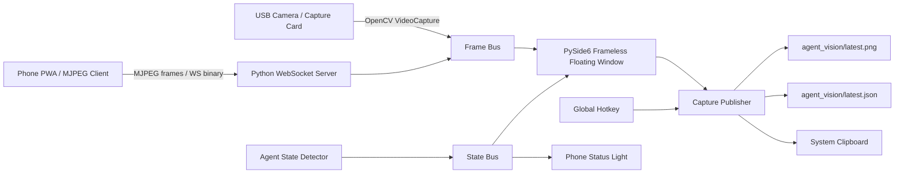
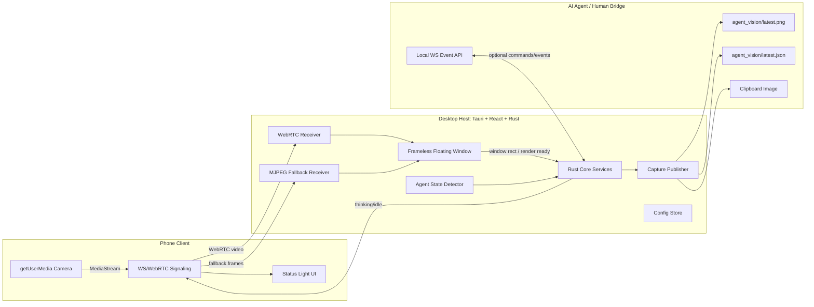
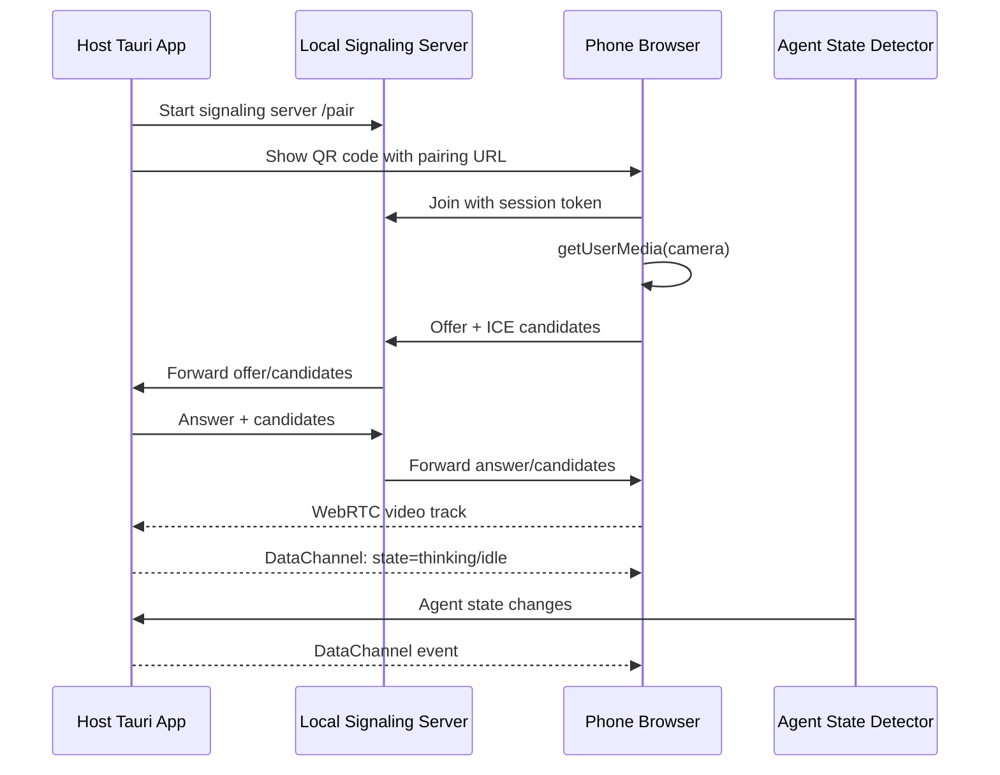
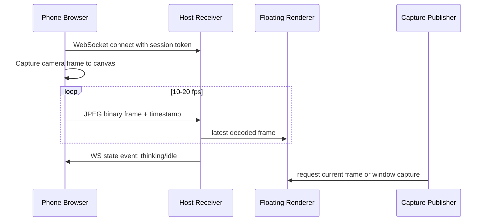
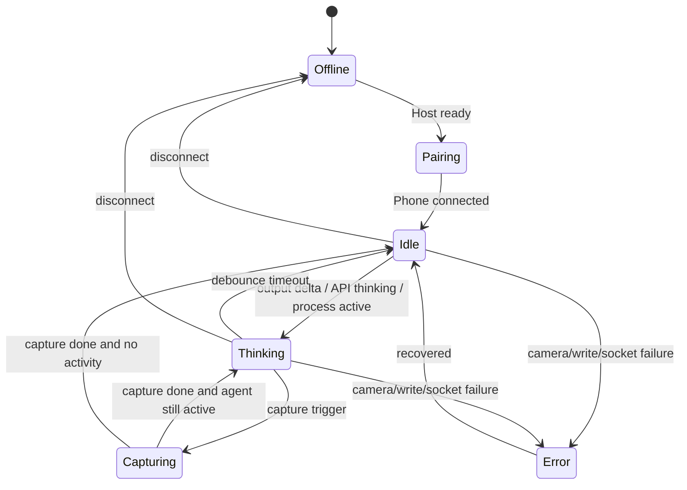
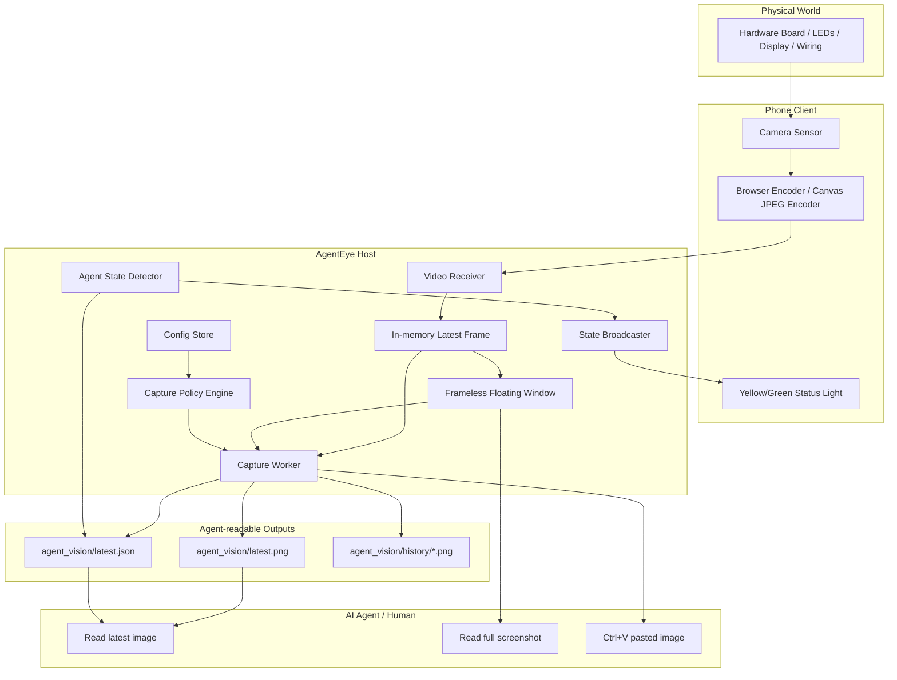
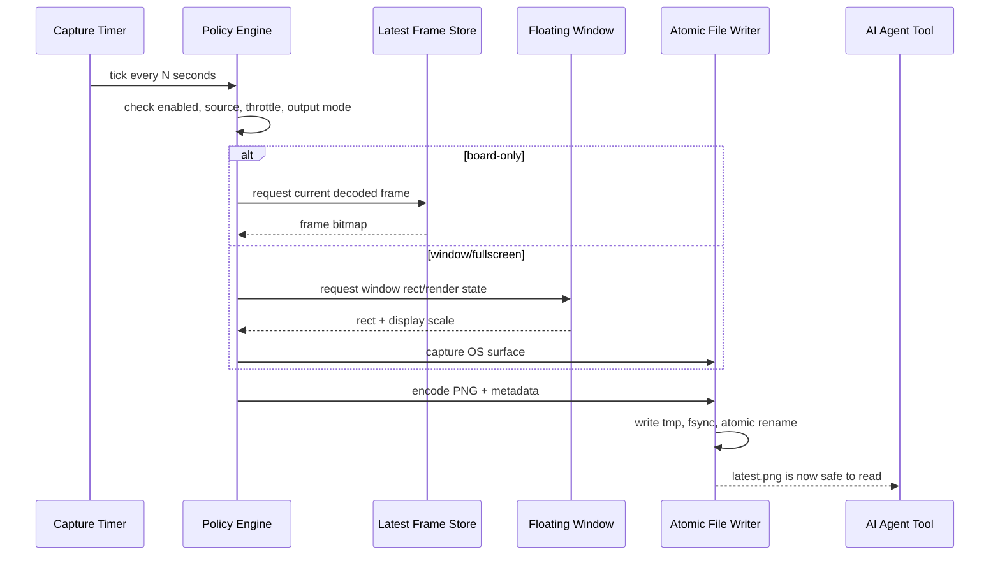
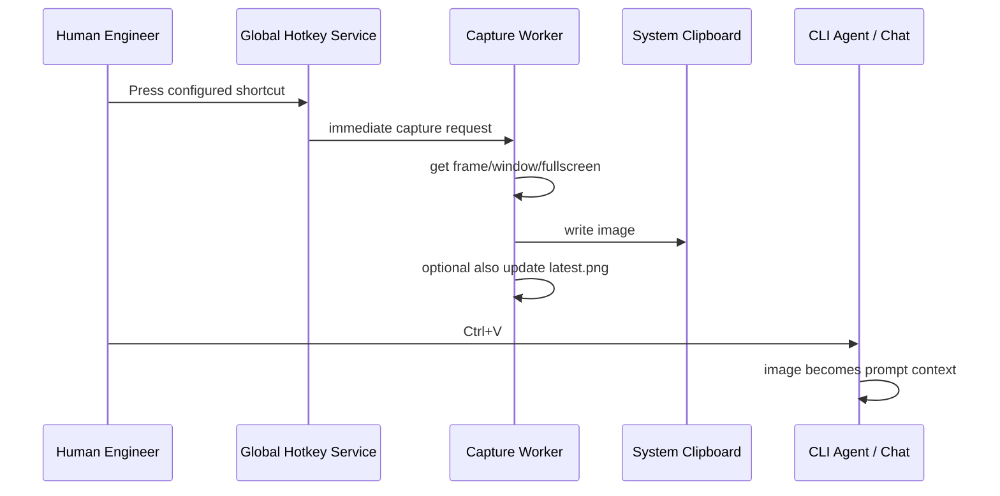
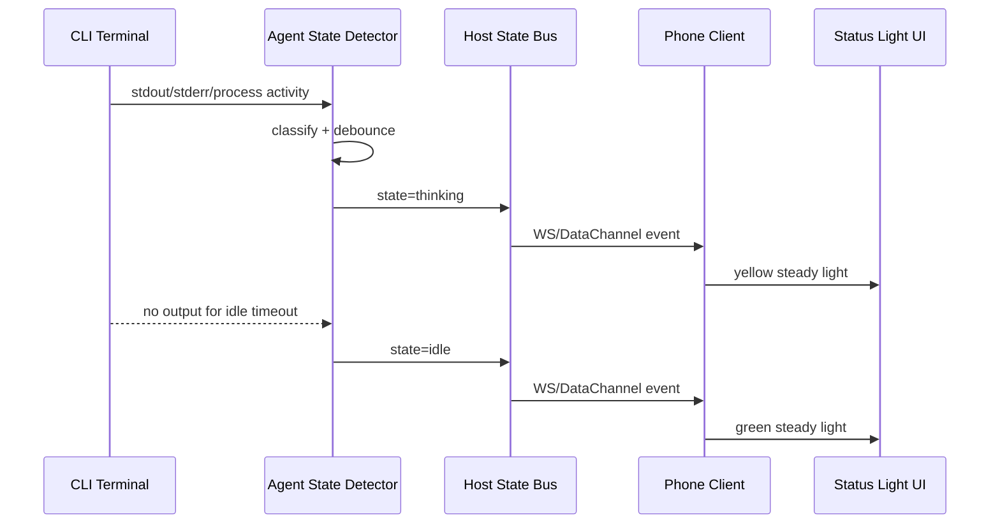

# AgentEye 产品架构与设计白皮书

**项目名**: AgentEye, 暂定名  
**阶段**: Phase 1, Product Definition + Architecture + UI/UX Design  
**版本**: v0.1 Architecture Draft  
**日期**: 2026-06-08  
**角色视角**: 首席产品经理 + 系统架构师 + 全栈工程负责人  

---

## 0. 执行摘要

AgentEye 的本质不是“把手机当摄像头”的又一个工具，而是一个面向 AI Agent 的物理世界观察层。它把真实硬件开发板、示波器屏幕、LED 状态、排线接法、按键动作等视觉信号，稳定地转译成 Agent 可读取的图像文件、剪贴板图像、屏幕上下文或未来的标准化视觉事件流。

现有工具如 Camo、OBS、DroidCam 的默认用户是人类，优化目标是视频会议、直播或录制。AgentEye 的默认用户是“人类工程师 + CLI/桌面 AI Agent 的协同系统”。它要解决的是: AI Agent 不能直接接管摄像头和物理硬件视野，但很多 Agent 可以读系统截图、读指定目录最新图片、读取剪贴板或让用户粘贴图片。

第一阶段推荐路线:

- **主线技术栈**: Tauri v2 + React + TypeScript + Rust Core + WebRTC/MJPEG 双协议适配。
- **验证技术栈**: Python + PySide6 + OpenCV 作为快速原型和算法实验环境。
- **视频传输主协议**: 局域网一对一优先 WebRTC；MVP 可先提供 MJPEG over WebSocket/HTTP 作为低复杂度 fallback。
- **Agent 对齐核心**: 不绑定任何单一 Agent。对外提供 `latest.png`、`latest.json`、hotkey-to-clipboard、local WebSocket event stream、可选 CLI 四类接口。
- **状态灯机制**: Host 通过 Agent State Detector 监测终端、进程、文件心跳或 MCP/CLI adapter，把状态通过 WebSocket/WebRTC DataChannel 推送到手机端；手机端以黄灯/绿灯做低认知负担反馈。
- **UI 风格**: Apple Industrial Style 作为默认产品气质，Cyberpunk Minimalist 作为可选主题。强调克制、精密、半透明、微弱状态光，而不是夸张霓虹。

推荐判断: 如果目标是开源独立软件、长期演进、UI 美学高级、未来迁移 Web/移动端方便，选择 **Tauri + React**。如果目标是两周内验证硬件场景可用性，先用 **Python + PySide6 + OpenCV** 做同构协议原型。

---

## 1. 产品定义

### 1.1 一句话定义

AgentEye 是一款让 AI Agent 能稳定观察物理硬件开发环境的开源桌面软件。它通过悬浮视觉窗、自动截图、剪贴板触发、手机摄像头和状态灯反馈，把开发板实况转换为 Agent 可以读取和人类可以低成本操作的视觉上下文。

### 1.2 核心用户

**主用户**: 嵌入式、硬件、机器人、IoT、FPGA、单片机、驱动工程师。  
**协同用户**: Claude Code、Aider、Codex CLI、未来 OS-World Agent、视觉 Agent、RPA Agent。  
**使用场景**:

- Agent 写串口驱动后，需要看开发板 LED 是否按预期闪烁。
- Agent 修改固件后，需要确认 OLED/LCD 屏幕显示结果。
- Agent 调试 GPIO、I2C、SPI、UART 时，需要看杜邦线、跳帽、板载指示灯和外设状态。
- 工程师低头操作硬件时，需要从手机余光知道 Agent 是否还在思考或已经停止输出。
- 人类不想反复手动截图、裁剪、复制、描述硬件画面。

### 1.3 非目标

第一阶段不追求:

- 替代 OBS/Camo 的视频会议能力。
- 做复杂视频剪辑、录制、直播推流。
- 直接控制硬件电源、继电器、示波器或机械臂。
- 强依赖某个闭源 Agent 的内部 API。
- 第一版就实现移动端原生 App。手机端先以 PWA/Web Client 为主。

### 1.4 产品北极星指标

AgentEye 的成功不是帧率越高越好，而是 Agent 能不能更少误判物理世界。

核心指标:

- **Observation Freshness**: `latest.png` 距当前时间的年龄，目标常态小于 5 秒，可配置到 1 秒。
- **Observation Availability**: Agent 请求图片时文件存在且未损坏的比例，目标 99.9%。
- **Capture Latency**: 从触发到图片写入稳定完成，目标小于 200ms，MVP 小于 500ms。
- **Visual Alignment Accuracy**: 悬浮窗/窗口截图区域与真实可见区域偏差，目标小于 2px 逻辑像素。
- **Agent State Signal Accuracy**: 黄/绿灯状态与 Agent 输出/思考阶段一致性，目标 90% 起步，后续通过 adapter 提升。
- **Human Cognitive Cost**: 工程师无需离开硬件工作姿态即可知道 Agent 状态。

---

## 2. 核心机制与产品模块

### 2.1 三层产品模型

AgentEye 应拆成三层，而不是做成一个大而混杂的窗口程序。

**Presentation Layer**:

- Host 悬浮窗: 展示摄像头画面，负责交互和视觉状态。
- Phone Client: 摄像头采集和状态灯反馈。
- Tray/Settings: 配置、连接、输出目录、快捷键、主题。

**Observation Layer**:

- Video Ingest: 接收 WebRTC/MJPEG/USB 摄像头。
- Frame Renderer: 低延迟渲染到悬浮窗。
- Capture Publisher: 定时/快捷键/事件触发截图并原子写入。
- Clipboard Publisher: 快捷键触发后把图片写入系统剪贴板。
- Metadata Publisher: 输出 `latest.json`，描述时间戳、分辨率、设备、状态、窗口矩形。

**Agent Alignment Layer**:

- Agent State Detector: 监测终端输出、进程状态、文件心跳或 adapter 事件。
- Agent Interface: 文件接口、剪贴板接口、WebSocket 事件接口、CLI 接口。
- State Broadcast: 将 Agent 状态推送到手机端状态灯。
- Policy Engine: 控制何时截图、截图哪里、写入哪里、保留多少历史。

### 2.2 为什么必须有 Agent Alignment Layer

如果只做一个漂亮悬浮窗，AgentEye 仍然只是“人类可见”的工具。Agent 真正需要的是稳定、机器可读、可轮询、可引用的视觉事实。

因此第一版就应该定义稳定输出约定:

```text
agent_vision/
  latest.png
  latest.json
  history/
    2026-06-08T14-10-05.140Z.png
  locks/
    latest.write.lock
```

`latest.json` 建议格式:

```json
{
  "version": "0.1",
  "captured_at": "2026-06-08T14:10:05.140Z",
  "source": "phone-webrtc",
  "mode": "window",
  "image_path": "./agent_vision/latest.png",
  "width": 1280,
  "height": 720,
  "display_scale_factor": 1.25,
  "window_rect": { "x": 1410, "y": 824, "width": 480, "height": 270 },
  "agent_state": "thinking",
  "camera_state": "connected",
  "sequence": 1842
}
```

写入原则:

- 永远先写临时文件 `latest.tmp.png`。
- PNG 完整编码和 fsync 后再原子 rename 到 `latest.png`。
- `latest.json` 同样采用临时写入再 rename。
- Agent 读取时永远不会读到半张图。

---

## 3. 技术架构方案一: 纯 Python 生态

### 3.1 推荐组成

- UI: PySide6 优先，PyQt6 备选。
- 摄像头输入: OpenCV `VideoCapture`。
- 视频网络输入: FastAPI/WebSocket 或 aiohttp；WebRTC 可用 aiortc，但复杂度高。
- 渲染: Qt `QLabel/QPixmap` 或 `QOpenGLWidget`。
- 截图: Qt `QScreen.grabWindow()` / `grabWindow(0)`，Windows 可接 mss 或原生 Windows Graphics Capture。
- 快捷键: Windows 原生 RegisterHotKey / 第三方 keyboard/pynput；macOS/Linux 需平台适配。
- 剪贴板: Qt Clipboard。
- 状态推送: WebSocket server。

官方依据:

- Qt `WindowStaysOnTopHint` 用于窗口置顶，`FramelessWindowHint` 可实现无边框窗口。
- Qt `QScreen.grabWindow()` 可用于窗口/屏幕截图，但 Qt 文档提示透明/分层窗口在 Windows 上存在捕获限制。
- OpenCV `VideoCapture` 是成熟的摄像头/视频输入接口。

### 3.2 Python 架构图



### 3.3 Python 优点

- 快速验证成本最低，OpenCV 对摄像头和帧处理非常顺手。
- 适合后续加入计算机视觉能力，如 LED 检测、七段数码管 OCR、屏幕区域识别。
- 打包后的单机 App 可以做到不依赖浏览器栈。
- 对嵌入式工程师友好，Python 生态与硬件工具链天然接近。

### 3.4 Python 风险

- 高级 UI 美学成本更高。Mica/Acrylic、无边框拖拽、圆角、阴影、DPI、跨平台一致性都需要大量平台细节。
- WebRTC 不如浏览器生态自然。aiortc 可用，但要自己处理信令、编解码、候选连接、网络边界。
- 全局快捷键、窗口捕获、透明窗口截图在三大系统上差异明显。
- 打包体积和依赖兼容性不一定比 Tauri 更轻。
- 如果未来要做 Web/PWA/移动端，Python UI 难以直接沉淀组件体系。

### 3.5 Python 适用结论

Python 是优秀的 **Prototype/Computer Vision Lab**，但不应成为长期主线。建议保留 `python-lab/` 子工程，用来验证:

- USB 摄像头和高拍仪兼容性。
- 截图发布频率与 Agent 读取体验。
- 状态灯状态机。
- 图像识别增强能力。

---

## 4. 技术架构方案二: 现代大前端生态

### 4.1 Electron 与 Tauri 分流

现代前端生态有两条路线:

**Electron + React**:

- Chromium 一致性强，WebRTC 能力成熟。
- `desktopCapturer`、`BrowserWindow`、`globalShortcut`、`clipboard/nativeImage` 都是成熟 API。
- UI 实现最快，毛玻璃、透明、动画、Canvas/WebGL 都自然。
- 代价是包体大、内存高、安全面更大。

**Tauri v2 + React + Rust**:

- Rust core 更适合写截图、文件原子写入、全局快捷键、系统托盘、状态检测。
- 前端 UI 仍然可用 React/Vue/Svelte 沉淀设计系统。
- 包体和运行资源通常更轻。
- Tauri v2 有移动端方向，未来手机端原生化路径更顺。
- 代价是底层系统能力有时需要 Rust 插件或平台 API，WebView 跨平台一致性不如 Electron 的 bundled Chromium。

### 4.2 推荐组成

- Desktop Host: Tauri v2 + React + TypeScript + Rust。
- UI System: React + CSS variables + motion tokens + Radix-like primitive 思路。
- Phone Client: PWA 优先，运行在手机浏览器；后续可升级 Tauri mobile / Capacitor / React Native。
- 视频主协议: WebRTC。
- 视频 fallback: MJPEG over WebSocket 或 HTTP multipart stream。
- 状态通道: WebSocket 或 WebRTC DataChannel。
- 文件发布: Rust side 原子写入 PNG/JSON。
- 截图: Rust core 调用平台截图库；Windows 优先 Windows Graphics Capture / DXGI fallback，macOS ScreenCaptureKit，Linux xdg-desktop-portal/PipeWire。

### 4.3 Tauri/React 架构图



### 4.4 为什么推荐 Tauri 而不是纯 Electron

AgentEye 的核心是系统级工具，不是重内容 Web App。它要长期稳定地处理窗口、截图、快捷键、文件发布、进程检测和低占用后台运行。Tauri 的 Rust core 更适合承载这些系统边界。React 则负责把 UI 做到高级、可维护、可主题化。

Electron 可以作为备选，尤其当以下条件优先时:

- 需要最稳定的一致 WebRTC/Canvas/Chromium 行为。
- 团队不想碰 Rust。
- 首版必须最快上线漂亮 UI。

但从“一劳永逸”和开源独立软件的长期资产看，推荐:

```text
Tauri v2 + React + TypeScript + Rust Core
```

并保留协议抽象，让 Electron 能作为替代 Shell 接入同一套 `AgentEye Observation Protocol`。

---

## 5. 协议选型: RTMP / WebRTC / MJPEG

### 5.1 需求排序

AgentEye 的视频协议不以广播为中心，而以近距离、低延迟、可对齐、可恢复为中心。

优先级:

1. 局域网低延迟。
2. 手机浏览器可直接采集摄像头。
3. 单 Host 单 Phone 简单配对。
4. 断线可恢复。
5. 可传状态信号。
6. 可降级到无需复杂 NAT 穿透的模式。

### 5.2 协议对比

| 协议 | 延迟 | 实现复杂度 | 手机浏览器友好 | 状态通道 | 适合 AgentEye |
|---|---:|---:|---:|---:|---|
| RTMP | 中，高于 WebRTC | 中 | 差，需要推流 App 或额外库 | 无原生数据通道 | 不推荐 |
| WebRTC | 极低 | 高 | 极好，浏览器原生 | DataChannel 原生 | 主协议 |
| MJPEG over HTTP | 低到中 | 低 | 好 | 需另开 WS | MVP fallback |
| JPEG/PNG over WebSocket | 低 | 低到中 | 好 | 同一 WS 可复用 | MVP fallback |
| HLS | 高 | 中 | 好 | 无 | 不适合 |

### 5.3 最终建议

**MVP 双轨**:

- `Protocol A`: MJPEG/JPEG over WebSocket，快速稳定，便于 Python/Tauri 都实现。
- `Protocol B`: WebRTC，作为主线实现，提供最低延迟和未来扩展。

**正式版主轨**:

- 手机端 `getUserMedia()` 获取摄像头。
- Host 提供本地配对页面和 signaling server。
- 同一局域网下建立 WebRTC PeerConnection。
- 视频通过 WebRTC track。
- 状态灯、心跳、设备能力、曝光参数通过 WebRTC DataChannel 或 WebSocket。

### 5.4 WebRTC 连接模型



### 5.5 MJPEG/WebSocket fallback 模型



Fallback 帧率可控制在 10-20 fps，硬件调试通常足够。WebRTC 主线可提供 30/60 fps 与更低延迟。

---

## 6. 屏幕/悬浮窗捕获设计

### 6.1 两种捕获模式

**Full Screen Capture**:

- 直接截全屏，保证 Agent 看到悬浮窗和周边 IDE/终端上下文。
- 对 Agent 最自然，尤其 OS-World 类 Agent 会读屏幕。
- 缺点是图片大、包含隐私内容、token 成本更高。

**Floating Window Capture**:

- 只截 AgentEye 悬浮窗内容。
- 文件小、干净、对硬件视觉更聚焦。
- 难点是透明/毛玻璃/圆角窗口的真实像素捕获在不同平台差异大。

### 6.2 推荐策略

第一版应同时支持三种输出:

1. `latest_fullscreen.png`: 全屏截图。
2. `latest_window.png`: 悬浮窗区域截图。
3. `latest_frame.png`: 原始摄像头帧，不包含 UI 边框。

默认给 Agent 读取:

```text
agent_vision/latest.png -> latest_window.png 或 latest_frame.png 的别名
```

用户可选择:

- **Agent Sees Board Only**: 只输出摄像头帧。
- **Agent Sees Floating Window**: 输出悬浮窗截图，包含状态灯和 UI。
- **Agent Sees Full Context**: 输出全屏截图，包含 IDE/终端/AgentEye。

### 6.3 捕获效率原则

- 不从渲染 UI 再反复压缩，优先从 frame buffer 直接发布 `latest_frame.png`。
- 窗口捕获只在需要 UI 状态一起出现在图中时启用。
- 定时截图间隔默认 5 秒，支持 1-60 秒。
- 手动快捷键触发永远高优先级。
- 捕获线程与 UI 线程隔离。
- PNG 写入在后台 worker 执行。
- 历史图保留上限可配置，默认 100 张或 24 小时。

### 6.4 Windows 优先捕获策略

Windows 是嵌入式开发者最常用环境之一，第一版应把 Windows 体验做扎实。

推荐顺序:

1. **原始摄像头帧发布**: 永远最稳。
2. **Windows Graphics Capture**: 用于窗口/显示器捕获，适合现代 Windows。
3. **DXGI Desktop Duplication**: 全屏 fallback。
4. **GDI/BitBlt/PrintWindow**: 最后 fallback，处理兼容性但不要依赖其高性能。

注意:

- 透明窗口、毛玻璃和系统合成可能导致窗口截图与用户看到的不同。
- 高 DPI 显示器需要记录 logical pixel 与 physical pixel 的换算。
- 多显示器布局可能存在负坐标。

---

## 7. Agent 状态灯机制

### 7.1 状态定义

状态灯不是装饰，而是硬件工程师的低认知负担反馈系统。

基础状态:

| 状态 | 手机灯色 | 含义 |
|---|---|---|
| `idle` | 绿灯常亮 | Agent 停止输出/等待用户 |
| `thinking` | 黄灯常亮 | Agent 正在生成、执行、思考或终端有持续输出 |
| `capturing` | 青色短闪 | Host 刚完成一次截图 |
| `error` | 红色慢闪 | 摄像头/连接/写入失败 |
| `pairing` | 蓝色呼吸 | 手机等待配对 |
| `offline` | 灰色微光 | Host 不可达或断线 |

用户要求中黄/绿是核心，其他状态应克制显示，不抢主信号。

### 7.2 Agent State Detector 输入源

不要把状态检测写死在某个 CLI。第一版定义多 adapter:

**Terminal Output Adapter**:

- 监测指定终端窗口或伪终端输出。
- 最近 N 秒有新增输出则 `thinking`。
- 超过 idle debounce 时间无新增输出则 `idle`。

**Process Adapter**:

- 监测进程名: `claude`, `aider`, `codex`, `python`, `node` 等。
- CPU/IO 活跃度超过阈值判定可能在工作。
- 适合作为辅助信号，不单独作为强判断。

**File Heartbeat Adapter**:

- Agent 或 wrapper 写入 `.agenteye/state.json`。
- 最可靠，适合未来与 CLI agent 深度集成。

**Local API Adapter**:

- AgentEye 提供 `POST /state` 或 WebSocket command。
- 外部工具主动告诉 Host: `thinking`, `idle`, `error`。

### 7.3 状态机



### 7.4 debounce 策略

直接用“有输出就是黄、无输出就是绿”会抖动。推荐:

- `thinking_enter_ms`: 100ms，有输出立即变黄。
- `idle_exit_ms`: 1800-3000ms，无输出一段时间才变绿。
- `capture_flash_ms`: 180ms，截图成功时短暂青色闪光，但不打断黄/绿主状态太久。
- `error_min_ms`: 3000ms，错误至少显示 3 秒，避免用户错过。

---

## 8. 详细数据流图

### 8.1 全局数据流



### 8.2 A 模式: 定时自动截图



### 8.3 B 模式: 快捷键复制到剪贴板



### 8.4 状态灯数据流



---

## 9. UI/UX 视觉系统

### 9.1 视觉方向

默认方向: **Apple Industrial Style**。  
可选主题: **Cyberpunk Minimalist**。

原因:

- 硬件工程师长时间使用，界面不能刺眼。
- AgentEye 是工具，不是游戏或视觉秀场。
- 高级感来自比例、材质、状态反馈和克制动效，而不是大面积霓虹。

### 9.2 Design Tokens 初稿

```text
Color / Apple Industrial
  bg.window: rgba(18, 20, 24, 0.72)
  bg.panel: rgba(28, 31, 36, 0.58)
  stroke.hairline: rgba(255, 255, 255, 0.12)
  text.primary: #F4F7FA
  text.secondary: rgba(244, 247, 250, 0.64)
  status.idle: #3CFF9A
  status.thinking: #FFD166
  status.capture: #61DAFF
  status.error: #FF4D6D

Color / Cyberpunk Minimalist
  bg.window: rgba(8, 10, 14, 0.78)
  stroke.hairline: rgba(0, 245, 255, 0.18)
  accent.cyan: #00F5FF
  accent.magenta: #FF2BD6
  accent.lime: #A6FF3D
  status.thinking: #FFD166
  status.idle: #32FF9A

Radius
  window: 18px
  control: 8px
  tiny-indicator: 2px

Shadow
  window: 0 20px 60px rgba(0, 0, 0, 0.42)
  glow.idle: 0 0 12px rgba(60, 255, 154, 0.42)
  glow.thinking: 0 0 16px rgba(255, 209, 102, 0.48)

Motion
  light.fade: 320ms cubic-bezier(.2,.8,.2,1)
  panel.show: 180ms cubic-bezier(.2,.8,.2,1)
  drag.resize: no animation
```

### 9.3 Host 悬浮窗视觉分级

**层级 1: 摄像头画面**

- 占据 100% 主面积。
- 无卡片嵌套。
- 支持 crop/fit/fill 三种模式。
- 默认轻微圆角裁切，确保画面像一块精密玻璃。

**层级 2: 微型状态指示**

- 右下角 6-8px 像素灯。
- 连接成功为绿，等待为蓝，错误为红。
- 呼吸周期 1800-2400ms。
- 状态灯不可变成大标签，不喧宾夺主。

**层级 3: Hover 工具条**

- 平时隐藏。
- 鼠标移入后淡入。
- 包含: pin, capture, mode, rotate, crop, settings。
- 图标优先，不用大段文字。

**层级 4: 设置面板**

- 从悬浮窗边缘弹出或独立小窗口。
- 配置输出目录、截图间隔、快捷键、视频源、主题、状态检测。
- 不覆盖主画面太久。

### 9.4 Host 悬浮窗骨架

```text
┌──────────────────────────────────────────────┐
│                                              │
│  Live hardware video                         │
│  board / LEDs / screen / wiring              │
│                                              │
│                                              │
│                                              │
│                              ┌────────────┐  │
│                              │ hover tools│  │
│                              └────────────┘  │
│                                           ▣  │
└──────────────────────────────────────────────┘

Window:
- frameless
- always on top
- resizable from invisible 6px edge hit area
- rounded 18px
- acrylic/mica background outside video crop
- drag zone: top 24px invisible area
- no visible title bar
```

### 9.5 Host 设置面板骨架

```text
┌──────────────────────────── AgentEye ────────────────────────────┐
│ Source      [ Phone: iPhone 15 Pro ▾ ]  [ Pair QR ] [ USB ▾ ]     │
│ Capture     Mode  Board only | Window | Fullscreen                │
│             Interval [ 5s ━━━━━●━━━━ ]  Output ./agent_vision     │
│ Agent       Detector Terminal | Process | File | API              │
│             State idle debounce [ 2.0s ]                          │
│ Hotkey      Capture & Copy  Ctrl+Alt+V                            │
│ Visual      Theme Industrial | Cyberpunk  Light subtle | vivid     │
│ Status      Camera connected · latest.png updated 1.2s ago        │
└───────────────────────────────────────────────────────────────────┘
```

### 9.6 手机端 UI

手机端不是普通预览页，它是“摄像头 + 物理状态灯”。

布局:

```text
┌──────────────────────────────┐
│                              │
│        camera preview         │
│                              │
│                              │
│                              │
│                              │
│                              │
│  ──────────────────────────  │
│  STATUS LIGHT PLANE          │
│  yellow/green physical glow  │
│  subtle glass reflection     │
└──────────────────────────────┘
```

关键设计:

- 顶部/中心是摄像头预览，便于工程师对准开发板。
- 底部 20-30% 是状态灯区域，显示黄/绿大面积渐变。
- 灯效不是扁平色块，而是由中心亮斑、边缘衰减、暗部反射组成。
- 亮度应有手动调节，避免实验室暗光刺眼。
- 手机端可一键锁定曝光、对焦、白平衡，减少画面跳动。
- 横屏模式用于高拍仪支架；竖屏模式用于手持手机。

### 9.7 手机状态灯动效

**黄灯 Thinking**:

- 色彩: `#FFD166` 到 `#FFB000`。
- 形态: 常亮，极轻微 4-6% 亮度呼吸。
- 意义: Agent 正在占用工程师等待时间，工程师可以继续看板子。

**绿灯 Idle**:

- 色彩: `#3CFF9A` 到 `#0EAD69`。
- 形态: 常亮，切换时 320ms 柔和 fade。
- 意义: Agent 停止输出，可以看结果或继续输入。

**错误 Red**:

- 色彩: `#FF4D6D`。
- 形态: 慢闪，周期 1200ms。
- 意义: 需要人类处理连接或写入错误。

### 9.8 交互原则

- 不用说明文字教育用户如何使用；用真实控件和状态呈现。
- 所有设置必须可在首次运行向导后修改。
- 主窗口不打断桌面工作流。
- 键盘快捷键应可自定义，并提示冲突。
- 默认行为保守: 只输出 board-only，避免泄露全屏隐私。
- 全屏截图必须有明显权限和目录提示。

---

## 10. 安全、隐私与开源边界

### 10.1 本地优先

AgentEye 默认不上传任何图片到云端。所有视频、截图、状态都在本机和局域网内流转。外部 Agent 能否读取图片，由用户的 Agent Tool 权限决定。

### 10.2 配对安全

- Host 显示一次性 QR token。
- token 有效期默认 5 分钟。
- 手机端连接后绑定 session。
- 局域网 WebSocket/WebRTC signaling 不接受无 token 连接。
- 配对页面显示 Host 名称和局域网 IP，避免连错设备。

### 10.3 输出目录安全

- 默认输出到用户选择目录或项目根 `agent_vision/`。
- 不写入系统敏感目录。
- 文件名固定时采用原子替换。
- 历史图可关闭。
- 全屏截图模式需要明确 opt-in。

### 10.4 开源许可建议

建议使用:

- App: Apache-2.0 或 MIT。
- 如果希望防止闭源商业直接拿走核心，可考虑 MPL-2.0。
- 设计资源和图标可单独 CC BY 4.0。

开源项目结构应清晰分层，方便社区贡献单一 adapter 或协议实现。

---

## 11. 推荐工程目录

```text
AgentEye/
  README.md
  docs/
    AgentEye_产品架构与设计白皮书.md
    adr/
      ADR-001-architecture-shell.md
      ADR-002-observation-protocol.md
      ADR-003-video-transport.md
    design/
      visual-system.md
      interaction-model.md
  apps/
    host-tauri/
      src/
      src-tauri/
    phone-web/
      src/
  packages/
    protocol/
      schema/
      typescript/
    ui/
      tokens/
      components/
  python-lab/
    camera-prototype/
    cv-detectors/
  agent_vision/
    .gitkeep
```

---

## 12. 技术栈最终对比

| 维度 | Python + PySide6 + OpenCV | Tauri + React + Rust | Electron + React |
|---|---|---|---|
| 原型速度 | 很快 | 中 | 快 |
| 高级 UI 美学 | 中，需要打磨 | 高 | 很高 |
| WebRTC | 中，需 aiortc | 高，前端原生 | 很高，Chromium 原生 |
| 系统截图 | 中，需平台适配 | 高，Rust 可接原生 API | 高，Electron API 成熟 |
| 全局快捷键 | 中，需库/平台适配 | 高，官方插件 | 高，官方 API |
| 文件原子写入 | 高 | 很高 | 高 |
| 性能/资源 | 中 | 高 | 中到低 |
| 跨平台一致性 | 中 | 中到高 | 高 |
| 移动端延展 | 低 | 中到高 | 中 |
| 设计系统沉淀 | 低 | 高 | 高 |
| 长期架构资产 | 中 | 很高 | 高 |

最终推荐:

```text
主线: Tauri v2 + React + TypeScript + Rust Core
辅助: Python Lab for CV/prototyping
备选: Electron Shell when Chromium consistency is more important than footprint
```

---

## 13. 分阶段路线图

### Phase 0: 架构冻结与视觉样机

- 确定产品名、定位、logo 方向。
- 产出 PRD、ADR、UI tokens、Figma 或 HTML visual prototype。
- 明确 `AgentEye Observation Protocol`。

### Phase 1: 可用 MVP

- Host frameless always-on-top window。
- Phone PWA 摄像头接入。
- MJPEG/WebSocket fallback 视频流。
- 定时写入 `agent_vision/latest.png`。
- 全局快捷键截图到剪贴板。
- 黄/绿状态灯基础 WebSocket 推送。
- Windows 优先。

### Phase 2: 主协议与跨平台

- WebRTC 视频主协议。
- QR 配对和 session token。
- Tauri Rust 截图 backend。
- macOS/Linux 基础支持。
- 状态检测 adapter: terminal/process/file/API。

### Phase 3: Agent 深度协作

- AgentEye CLI: `agenteye capture`, `agenteye state thinking`。
- Claude Code/Aider/Codex wrapper examples。
- `latest.json` schema 稳定发布。
- 可选 MCP server，让 Agent 主动请求 capture。

### Phase 4: 硬件视觉智能

- LED 状态检测。
- 七段数码管 OCR。
- LCD/OLED 区域识别。
- 板卡 ROI 标注。
- 多摄像头和多视角。

---

## 14. 关键架构决策

### ADR-001: UI Shell 选择 Tauri v2

决策: 主线采用 Tauri v2 + React。  
理由: 系统能力、资源占用、Rust core、前端设计系统和未来移动端方向之间平衡最好。  
后果: 需要 Rust 工程能力；某些系统 API 需要自研插件。

### ADR-002: Observation Protocol 优先于具体实现

决策: 先定义 `latest.png/latest.json/WebSocket events/CLI`，不让产品绑定某个 Agent 或某个 UI 框架。  
理由: Agent 生态变化快，文件和本地事件协议最耐久。  
后果: 第一版要多做一点协议规范，但后续迁移成本显著降低。

### ADR-003: WebRTC 主协议 + MJPEG fallback

决策: WebRTC 作为长期主协议，MJPEG/WebSocket 作为 MVP fallback。  
理由: WebRTC 延迟低且手机浏览器原生支持；MJPEG 简单可靠、调试友好。  
后果: 需要维护两个接入路径，但可以通过 Frame Bus 统一下游。

### ADR-004: 默认 board-only 输出

决策: 默认 `latest.png` 输出原始摄像头帧或窗口内视频区域，不默认全屏。  
理由: 降低隐私泄露和 token 成本。  
后果: Agent 默认缺少 IDE 上下文，但用户可切换。

---

## 15. 参考资料

- Electron BrowserWindow API: https://www.electronjs.org/docs/api/browser-window
- Electron desktopCapturer API: https://www.electronjs.org/docs/latest/api/desktop-capturer/
- Electron globalShortcut API: https://www.electronjs.org/docs/latest/api/global-shortcut
- Electron clipboard/nativeImage API: https://www.electronjs.org/docs/latest/api/clipboard
- Tauri global shortcut plugin: https://v2.tauri.app/plugin/global-shortcut/
- Tauri file system plugin: https://v2.tauri.app/plugin/file-system/
- Tauri WebviewWindowBuilder docs: https://docs.rs/tauri/latest/tauri/webview/struct.WebviewWindowBuilder.html
- Tauri security model: https://v2.tauri.app/security/
- MDN getUserMedia: https://developer.mozilla.org/en-US/docs/Web/API/MediaDevices/getUserMedia
- WebRTC media devices guide: https://webrtc.org/getting-started/media-devices
- Qt QScreen docs: https://doc.qt.io/qtforpython-6.8/PySide6/QtGui/QScreen.html
- Qt WindowStaysOnTopHint docs: https://doc.qt.io/qt-6/qt.html
- OpenCV VideoCapture docs: https://docs.opencv.org/3.4/d8/dfe/classcv_1_1VideoCapture.html
- Microsoft Windows Graphics Capture overview: https://learn.microsoft.com/en-us/windows/uwp/audio-video-camera/screen-capture

---

## 16. 第一阶段结论

AgentEye 最值得长期投入的底层架构是:

```text
Phone PWA camera
  -> WebRTC/MJPEG transport
  -> Host Frame Bus
  -> Frameless Floating Window
  -> Atomic Capture Publisher
  -> latest.png/latest.json/clipboard/local API
  -> Agent reads visual context

Agent State Detector
  -> State Bus
  -> Phone yellow/green physical light
```

这条链路把物理世界、桌面 UI、人类操作和 AI Agent 的工具权限连接在一起。它足够简单，可以从 MVP 开始；也足够抽象，可以一路演进到多摄像头、视觉识别、MCP server、硬件自动化和移动端原生应用。

最终建议: **不要把 AgentEye 做成“摄像头软件”。要把它做成“AI Agent 的物理观察协议与桌面载体”。**
